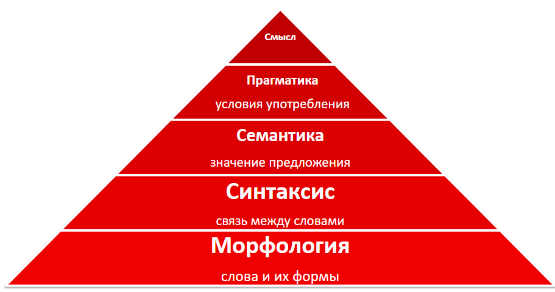

# Продвинутые задачи и модели NLP. Морфология
Данный курс посвящен основным задачам морфологии и способам их решения.

 Будут рассмотрены:
- Основные понятия 
- Готовые инструменты
- Способы решения задач
- Deep learning подходы

Старые [презентации](https://drive.google.com/drive/u/0/folders/0B07mCd0ZUKkjb1lCMmxrQXlYNGc) Ильи Гусева.

 

## Структура курса
<!-- TOC -->
- [Основные понятия](#Основные-понятия)
- [Морфологический анализ](#Морфологический-анализ)
- Исправление ошибок
- Морфологический синтез
<!-- /TOC -->

Будут рассмотрены state-of-the-art решения для следующих задач:
- [Part-of-speech tagging](http://nlpprogress.com/english/part-of-speech_tagging.html)
- [Grammatical error correction](http://nlpprogress.com/english/grammatical_error_correction.html)
- [Lexical normalization](http://nlpprogress.com/english/lexical_normalization.html)
- 

 

## Основные понятия
**Морфология** - раздел грамматики, основными объектами которого являются  **слова** естественных языков, их значимые части и морфологические признаки.

#### Морфология изучает:
- Словоизменение
- Словообразовние 
- Части речи
- Грамматические значения

 

## Грамматическое значение

Значение, выражаемое словоеизменительной **морфемой** 

**Морфема** - наименьшая еденица языка, имеющая некоторый смысл. 

Морфемы подразделяются на два основных типа - **корневые** и **аффиксальные**

**Корень** - основная значимая часть слова.

**Аффикс** - вспомогательная часть слова, присоеденяемая к корню и служащая для словообразования и выражения грамматисеских значений.

#### Типы аффиксов
- **Префиксы** (приставки в русском), 
**постфиксы** (суффиксы и окончания в русском), 
**интерфиксы** (для связи корней в сложны словах), 
**инфиксы** (вставляются в середину корня в индонезийских языках) 
и **трансфиксы** (разрывают корень из согласных гласными, например в арабском языке)
- **Словообразующие** (деривационные), которые образуют новые слова с новыми значениями (суффиксы и приставки в русском),
 и **формообразующие** (реляционные), которые образуют формы слов, выражая одну или несколько грамматических категорий 
 и указывая на связь с другими членами предложения (в флектиыных языках, в т.ч. русском такие морфемы называют флексиями).   

 

## Граммемы и грамматические категории
**Грамматическая категория** -  замкнутая система взаимоисключающих и противопоставленных друг другу грамматических значений (граммем),
 задающая разбиение обширной совокупности словоформ (или небольшого набора высокочастотных словоформ с абстрактным типом значения) на непересекающиеся классы,
 различие между которыми существенно сказывается на степени грамматической правильности текста.

#### Примеры грамматических категорий
- **Именные**: падеж, род, определенность, одушевленность, личность 
- **Глагольные**: время, вид, лицо, наклонение, залог
- **"Оба"** - число

**Граммема** -  грамматическое значение, понимаемое как один из элементов грамматической категории;
 различные граммемы одной категории исключают друг друга и не могут быть выражены вместе.

#### Примеры граммем:
- Единственное и множественное число
- Мужской, женский и средний род 
- Именительный, родительный и т.д. падежи

Следовательно **грамматическое значение** - набор граммем всех категорий, характерных для данной части речи. 
Например, для “ежа”: существительное, одушевлённое, мужской род, единственное число, родительный падеж.

## Грамматическое и лексическое значение
- Грамматические значения образуют замкнутый более структурируемый класс.
- Грамматические значения выражаются в принудительном порядке. (У существительно всегда есть категории числа, рода, падежа)
- Лексические и грамматические значения отличаются с точки зрения способов и средств их формального выражения. 
(Грамматические значения выражаются с помощью реляционных морфем)
- Грамматические значения могут не иметь полного соответствия во внеязыковой сфере. (род существительных *табуретка* и  *стул* мотивированы их окончаниями)

### Характерные размеры грамматических систем
#### Для одного языка:
- ~30 грамматических категорий
- До 90 граммем на категорию
- В среднем 4-5 граммем на категорию

#### Для одной части речи:
- В среднем до 4 грамматических категорий
- До 20 грамматических категорий

 

## Глоссарий
- **Вокабула**:
  - Заголовок словарной статьи; 
  - Слово иностранного языка с переводом на родной язык; 
  - Графическое слово
- **Лемма** - нормальная (словарная) форма слова. Для русского языка характерно:
  - для существительных - именительный падеж, единственное число
  - для прилагательных - именительные падеж, единственное число, мужской род
  - для глаголов, причастий и деепричастий - глагол в инфинитиве несовершенного вида
- **Словоформа** - слово с определенной леммой и грамматическим значением. *"Ворон"* и *"(к) ворону"* - разные словофромы одной лексемы.
- **Лексема** - набор всех словоформ слова. Т.е. *"Ворон"*, *"(к) ворону"*, *"вороном"*, *"(о) вороне"*, *"вороны"* и т.д.

 

## Словоизменительная парадигма
В лингвистике список словоформ, принадлежащих одной лексеме и имеющих разные грамматические значения.  Обычно представлена в виде таблицы. 
Словоизменительная парадигма выступает образцом того, как строятся словоизменительные формы для целых классов лексем (склонений существительных, спряжений глаголов и т. п.)

<table align="center">
<tr><td>

||Ед. ч.|Мн. ч|
|:---|:---:|:---:|
|**И**|рука|руки|
|**Р**|руки|рук|
|**Д**|руке|рукам|
|**В**|руку|руки|
|**Т**|рукой|руками|
|**П**|руке|руках|

</td><td>

||Ед. ч.|Мн. ч|
|:---|:---:|:---:|
|**И**|тубус|тубусы|
|**Р**|тубуса|тубусов|
|**Д**|тубусу|тубусам|
|**В**|тубус|тубусы|
|**Т**|тубусом|тубусами|
|**П**|тубусе|тубусах|

</td><td>

|||
|:---:|:---:|
|читать|тонуть|
|читала|тонула|
|читая|?|
|читаемый|?|
|читанный|?|

</td></tr>
</table>

#### Парадигма определяет:
- неизменяемое, классифицирующее грамматическое значение лексемы;
- какие есть формы у лексемы;
- как записываются формы лексемы.

 

## Словообразовательная парадигма
Совокупность производных слов (дериватов) от одной основы.
- у образованных слов своё словоизменение
- лексемы с одинаковым словоизменением могут по-разному образовывать дериваты

<table align="center">
<tr><td>

||||
|:---:|:---:|:---:|
|слон|слоник|слонёнок|
|краб|крабик|крабёнок|

</td><td>

||||
|:---:|:---:|:---:|
|Алёна|Алёночка|Алёнушка|
|Лена|Леночка|Ленушка|

</td></tr>
</table>

 

## Классификация словоизменения

#### 1. Изолирующие (аморфные, односложные, корневые) языки 
Языки с низким соотношением морфем к слову. Слова в максимально изолирующем языке будут состоять только из одной морфемы — корня,
 не образуя ни составных слов, ни сочетаний с суффиксами, префиксами и т. д. (Например слово "хаки" в русском). Также изолирующие языки имеют тенденцию избегать служебные слова,
 поэтому порядок в слов в предложении очень важен

 Изолирующие языки распространены в Юго-Восточной Азии:
- Вьетнамский язык
- Классический китайский язык
- Бирманский язык
- Тайский язык
- Кхмерский язык в Камбодже
- Лаосский язык 

#### 2. Аналитические языки
Являются изолирующими, однако синтаксическая информация предаётся при помощи отдельных грамматикализированных слов вместо морфологии. Типичные представители: 
английский, голландский, болгарские языки.

 

#### 3. Синтетические языки
Типологический класс языков, в которых преобладают синтетические формы выражения грамматических значений.

В синтетических языках грамматические значения выражаются в пределах самого слова (аффиксация, внутренняя флексия, ударение, супплетивизм),
 то есть формами самих слов. Для выражения отношений между словами в предложении могут быть использованы также элементы аналитического строя
 (служебные слова, порядок знаменательных слов, интонация).

#### 4. Флективные языки
Язык синтетического типа, при котором доминирует словоизменение при помощи флексий — формантов, сочетающих сразу несколько значений. 
Типичным примером является русский: 
- стел-ю (НВ+ЕЧ)
- стел-ила (ПВ+ЕЧ+ЖР)
- стел-ись (ЕЧ+Повелит)
- стел-ющийся (Прич+НВ+ЕЧ+МР)
- стел-ясь (Дееприч+НВ)

#### 5. Аглютитативные языки
Язык синтетического типа, в котором доминирующим типом словоизменения является агглютинация
(«приклеивание» различных формантов (суффиксов или префиксов)), причём каждый из них несёт только одно значение.

Пример (турецкий):  **ev**(дом) + **ler**(МнЧ) + **im**(выражаает принадлежность *1Л, ЕЧ*) + **de**(местный падеж) = **evlerimde** (В моих домах); 
**evimde**(В моём доме); **evlerde**(В домах) 
 

 

## Дополнительно

#### Аблаут (чередование гласных)
"Внутрення флексия": соб-рать - соберу - собираю

#### Морфема внутри корня, разрывная мофрология
Арабский язык: 
- **k t b** "писать" (корень) 
  - +**-a-a-** Прош.Вр., Акт.залог (огласовки) 
  - +**-a** 3л, Ед.ч, МР (суффикс (окончание)) 
  - =**kataba** "написал"
- **k tt b** Интенсив ~«много писать» (корень) 
  - +**-u-i-**	Прош.Вр., Пассив.залог (огласовки) 
  - +**tu-____-u** 3л, Ед.ч, ЖР., Имперф, пассив (префикс, суффикс) 
  - =**tukuttibu**	 "(её) много писали"

 

## Задачи компьютерной морфологии
- **Спеллинг** - проверка слова по словарю
- **Морфологический анализ** - определение грамматического значения и леммы у словоформы
- **Морфологический синтез** - построение словоформы по лемме и грамматическому значению
- **Исправление опечаток** - поиск наиболее близкого слова в слоаваре

Далее подробно о каждой задаче и способах её решения.

## Морфологический анализ
Морфологический анализ в лингвистике — определение морфологических характеристик слова.

#### Задача морфологического анализа
- Получение леммы
- Получение грамматического значения

Существуют уже готовые морфологические анализаторы, которые справляются с этой задачей. 
Например, **MyStem** и **pymorphy**. Чтобы поближе с ними познакомиться, предлагается изучить [morph_analyzers.ipynb](./morph_analyzers.ipynb)